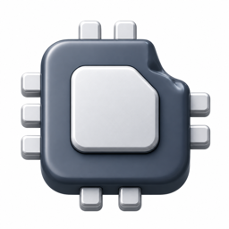
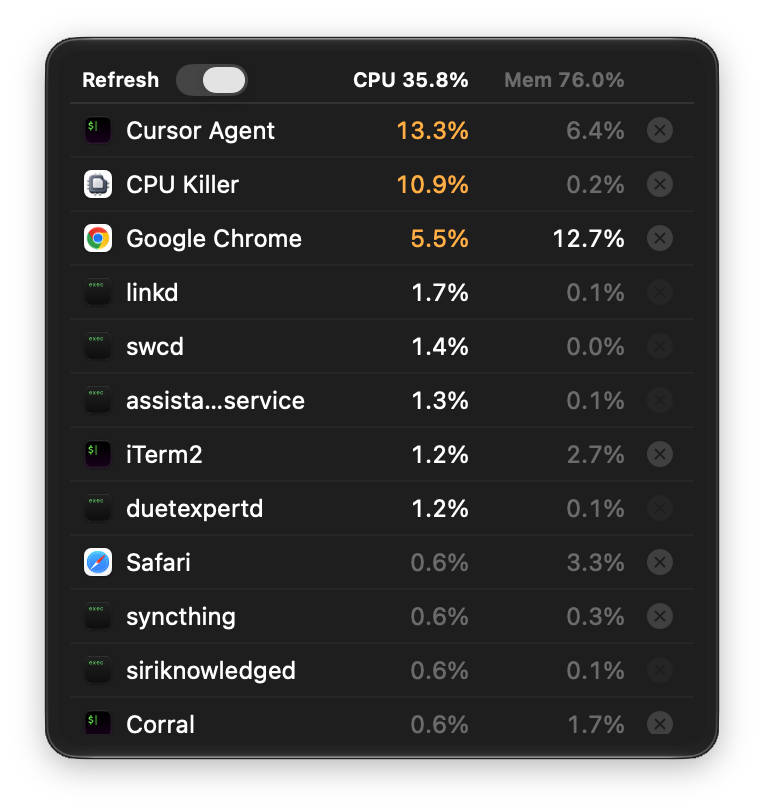

**Languages:** English | [简体中文](README.zh-CN.md)

# CPU Killer

<p align="center">
  
</p>

CPU Killer is a **macOS menu bar process table**. When the machine feels stuck, open it, see which app is using the CPU, and end that row.

It is not Stats or Activity Monitor. There is no process tree and no sensors. The process table lives in the menu bar. If you hide that icon, a small recovery window is how you find the app again — it is not a desktop process table.

**Requires macOS 26 or later.** Open source under the MIT License. Everything stays on your Mac — no account, no telemetry.

<p align="center">
  
</p>

## Supported platforms

- **macOS 26+** (Apple silicon and Intel)
- **Not Windows or Linux.** This app reads macOS process identity, lives in the menu bar, and ends local processes. Those APIs do not exist elsewhere.

## Install

### Homebrew (recommended)

```sh
brew tap x0c/tap
brew install --cask cpu-killer
```

### Direct download

Grab the latest **signed and notarized** `CPU-Killer-x.y.z.dmg` from the [releases](https://github.com/x0c/CPUKiller/releases/latest) page, then drag CPU Killer to `/Applications`.

CPU Killer checks for updates automatically (via [Sparkle](https://sparkle-project.org)). Right-click the menu bar icon for **Check for Updates…**.

### Build from source

Requires Xcode 26+ and [XcodeGen](https://github.com/yonaskolb/XcodeGen):

```sh
git clone https://github.com/x0c/CPUKiller.git
cd CPUKiller
xcodegen generate
xcodebuild -project CPUKiller.xcodeproj -scheme CPUKiller -configuration Release \
  -destination 'platform=macOS' -derivedDataPath build/DerivedData build
rm -rf "/Applications/CPU Killer.app"
ditto "build/DerivedData/Build/Products/Release/CPU Killer.app" "/Applications/CPU Killer.app"
open "/Applications/CPU Killer.app"
```

## Usage

1. Click the menu bar dual ring (outer = CPU, inner = memory) to open the table under the icon.
2. Rows show a human name, whole-machine CPU %, physical memory %, and an end control. Click the CPU or memory header to sort that column high-to-low.
3. Hover the end control to pin that row so a refresh cannot swap it out from under the click. Click to end it.
4. Click outside the table to close it. Right-click the icon for Launch at Login, Hide Menu Bar Icon, Open Main Window, Settings, Check for Updates, or Quit.
5. Launch at login is off by default. Hiding the menu bar icon opens a small recovery window with Show Menu Bar Icon.

## Features

- Flat table of the processes that actually matter, with human names (ChatGPT stays ChatGPT, not `node`)
- Whole-machine CPU % (capped at 100%) and physical memory %
- One-click end for your own processes; system processes stay listed but cannot be killed
- Live refresh with a freeze switch so you can aim; hovering End pins that row
- Menu bar dual ring keeps updating even when the table is closed or frozen

## Not in scope

A Stats/iStat sensor dashboard, a dock icon, a desktop process table, an expandable process tree, Mac App Store, sandboxing, Accessibility / Full Disk Access, or Windows/Linux clients. A small recovery window after hiding the menu bar icon is required and is not a process table.

## License

[MIT](LICENSE)
